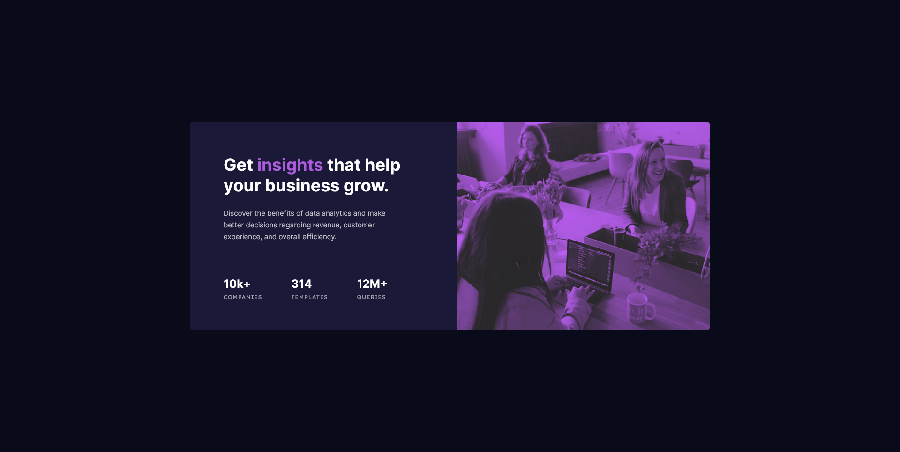

# Frontend Mentor - Stats preview card component solution

This is my solution to the [Stats preview card component challenge on Frontend Mentor](https://www.frontendmentor.io/challenges/stats-preview-card-component-8JqbgoU62).

## Table of Contents

- [Frontend Mentor - Stats preview card component solution](#frontend-mentor---stats-preview-card-component-solution)
  - [Table of Contents](#table-of-contents)
  - [Overview](#overview)
    - [The Challenge](#the-challenge)
    - [Screenshot](#screenshot)
    - [Links](#links)
  - [My Process](#my-process)
    - [Project goals](#project-goals)
    - [Built with](#built-with)
    - [What I learned](#what-i-learned)
    - [Major challenges](#major-challenges)
    - [Continued development](#continued-development)
    - [Useful resources](#useful-resources)
  - [Author](#author)

## Overview

### The Challenge

Users should be able to:

- View the optimal layout depending on their device's screen size (in this case, desktop (1440px) and mobile (375px))

### Screenshot

### Links

- Solution URL: [GitHub](https://github.com/gnjmonroe/stats-preview-card-component-main)
- Live Site URL: [Live Site](https://gnjmonroe.github.io/stats-preview-card-component-main/)

## My Process

### Project goals

- Practice semantic HTML tags
- Practice using Sass/SCSS (especially architecture, partials, imports, and maps)
- Achieve a (near) perfect replica of the screenshot

### Built with

- Semantic HTML5 markup
  - ARIA
- Sass/SCSS
  - Partials, maps, variables, etc.
- CSS Style Guide (BEM)
- Mobile-first workflow

### What I learned

- Analyzing a reference
- Structuring a project
- Background blend modes
- Very light touch on ARIA to maintain (some) accessibility
- Sass/SCSS architecture (based off of [The 7-1 Pattern](https://sass-guidelin.es/#the-7-1-pattern))

### Major challenges

- Getting sizing and spacing right.
  - Setting up reference JPGs in XD to line up with my liveserver and then alt-tabbing as needed is laborious to set up and annoying to operate.
  - I found weird inconsistencies between the stylesheet and the reference jpg file (e.g., some of the text appears to have font weights of 300 or 600, the stat unit label font changes at the breakpoint).
- Getting the blend modes right, which are still not perfect.
  - After realizing that simply adjusting the opacity of a ::before pseudo element wouldn't work, I ended up experimenting in photoshop to reverse-engineer the reference image.
  - I ended up having to use filters in addition to background-blend-mode, though its still not perfect. The reference image shadows are more purple than black.
  - A better option is probably to use SVG gradient map filters
- Maintaining accessibility with using background-blend-mode.
  - I resisted using background-blend-mode for a while because it would mean switching an img element to a div element and also giving up alt text on the images. I ended up finding a Stack Overflow article that suggested using ARIA labels to maintain some accessibility and took that approach (refer to [Useful resources](#useful-resources)).

### Continued development

My highest priority right now is to continue practicing semantic HTML. Over the next few projects, I'd like to learn how things like ARIA and data-* attributes can enhance a basic semantic HTML document, as well as functionalities in Javascript, accessibility, and testing.

Although I just used the same old scrappy CSS reset from my grad school projects, I want to learn more about CSS resets and best practices for them. I'm planning on starting with [this reset and its documentation](https://piccalil.li/blog/a-modern-css-reset/).

Finally, I'd want to continue to develop my workflow, particularly my planning and time estimation skills. I went way over my time budget on this as I started noticing weird details and inconsistencies in the screenshots and the style guide and spent more time contemplating what to do about them, but other projects will have similar unexpected events and I need to learn how to account for them to be an effective designer/developer.

----------

There's ~~probably~~ definitely a better way to do media queries in Sass/SCSS, but I don't know it yet and I've already overcomplicated this project enough. This is in the back of my mind for when a more complicated project comes up though. [This](https://css-tricks.com/approaches-media-queries-sass/) and [this](https://www.sitepoint.com/managing-responsive-breakpoints-sass/) are probably where I'll start.

### Useful resources

- [BEM](http://getbem.com/introduction/) - The official BEM documentation.
- [SO - How to make a background image accessible](https://stackoverflow.com/questions/41942992/how-to-make-background-image-accessible/48916304) - This is what led me to use an ARIA label on my image divs.
- [SVG Gradient Map Filter](https://yoksel.github.io/svg-gradient-map/#/) - a tool for generating code for SVG gradient maps.
- [CSS Tricks - Using SVG to Create a Duotone Effect on Images](https://css-tricks.com/using-svg-to-create-a-duotone-image-effect/) - Instructions for using SVGs to effect a duotone on an image.

## Author

- Website - [Gregory Nathan Jinsoo Monroe](https://www.jinsoo.co)